# Playwright + Allure Reporting

A hands-on tutorial built around a **real, runnable test automation framework** for the Sauce Demo Shopify store. Every screenshot in this guide comes from the report that the project itself generates.

**What you will learn:** setup · reporter integration · steps · screenshots, video & traces · network and console capture · metadata & behaviors · retries & flaky tests · history & trends · categories · custom themes · CI/CD with GitHub Actions, Jenkins and Docker.

Playwright 1.63 · allure-playwright 3.12 · Allure Report 2.46 · TypeScript 5

<!-- end-cover -->

# 1. Introduction

Test automation only pays off when people can *understand* its results. A green tick is easy to read; a red cross without context sends somebody off to rerun the test locally, dig through CI logs and guess. **Allure Report** fixes that by turning raw results into an interactive web report with:

- a dashboard of pass/fail statistics and **trends across builds**;
- a **step-by-step** breakdown of each test with timings;
- **attachments**: screenshots, videos, traces, HTML snapshots, network logs, console output, JSON/CSV files;
- **business-level grouping** (epics → features → stories), severities, owners and links to issues;
- **retries**, **flaky-test** detection, custom **defect categories** and an execution **timeline**.

This tutorial walks through the `playwright-allure-showcase` project. It is both a working test suite (about 50 real tests of login, product browsing, search, cart, checkout and the storefront API) and a reference in which **every Allure feature has a test that demonstrates it**.

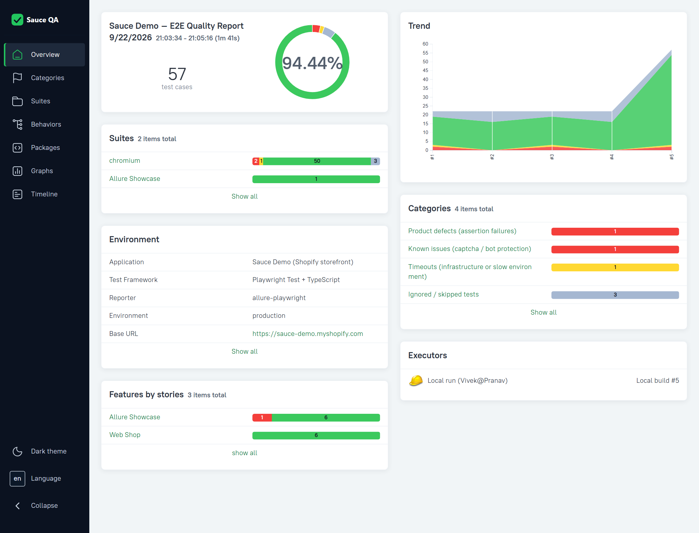

## 1.1 The system under test

The tests target **https://sauce-demo.myshopify.com**, a public Shopify demo store. It has 7 products (2 of them sold out), a customer login protected by **hCaptcha**, an AJAX cart API (`/cart.js`, `/cart/add.js`) and Shopify's hosted one-page checkout.

> **Why hCaptcha matters.** Automated login submissions are intercepted by the captcha, so the store never shows a "wrong password" message to a bot. The login tests therefore assert what *can* be verified (the user stays signed out) and one showcase test documents the limitation as a **known issue**. Checkout tests stop before payment: no card data is ever entered, so no order can be placed.

## 1.2 How the pieces fit together

| Piece | Role |
|---|---|
| **Playwright Test** | Runs the tests, provides fixtures, retries, screenshots, video and traces |
| **allure-playwright** | A Playwright *reporter* that writes one JSON file per test result into `allure-results/` |
| **allure-js-commons** | The runtime API used inside tests: `allure.step()`, `allure.epic()`, `allure.attachment()`, … |
| **Allure Report 2** (`allure-commandline`, Java) | Turns `allure-results/` into the HTML report in `allure-report/` |

```text
 playwright test ──► allure-playwright reporter ──► allure-results/*.json + attachments
                                                           │
                                   allure generate  ◄──────┘   (+ history/, environment, categories)
                                          │
                                          ▼
                                   allure-report/index.html
```

# 2. Setup & Installation

## 2.1 Prerequisites

| Tool | Version | Why |
|---|---|---|
| Node.js | 20 or newer (22 LTS recommended) | Runs Playwright and the scripts |
| Java (JRE/JDK) | 8 or newer (17 recommended) | The Allure 2 command-line tool is a Java application |
| Git | any | Clone the project |

Check them:

```bash
node -v        # v22.x
java -version  # openjdk version "17..."
```

## 2.2 Install the project

```bash
git clone <your-fork-url> playwright-allure-showcase
cd playwright-allure-showcase
npm ci                                  # or: npm install
npx playwright install chromium         # add firefox webkit for cross-browser runs
cp .env.example .env                    # optional: adjust settings
```

`npm ci` installs everything, including the Allure CLI (`allure-commandline`), so you do **not** need a global Allure installation.

## 2.3 Adding Allure to your *own* Playwright project

If you are starting from scratch, these are the only packages you need:

```bash
npm i -D @playwright/test allure-playwright allure-js-commons allure-commandline
```

Then register the reporter in `playwright.config.ts` (next chapter) and you are done.

## 2.4 Project structure

```text
playwright-allure-showcase/
├── src/
│   ├── tests/
│   │   ├── auth/            login.spec.ts, account-access.spec.ts
│   │   ├── products/        catalog, product-details, search, products-api
│   │   ├── cart/            cart.spec.ts
│   │   ├── checkout/        checkout.spec.ts
│   │   └── showcase/        allure-features.spec.ts, visual-evidence.spec.ts
│   ├── pages/               Page Object Model (BasePage, LoginPage, CartPage, ...)
│   ├── fixtures/
│   │   ├── base.fixture.ts  page objects + logger + network/console monitors + evidence
│   │   └── data/            products.json, auth.json, checkout-customers.csv, ...
│   ├── utils/
│   │   ├── allure-helper.ts      typed facade over the Allure API + @step decorator
│   │   ├── logger.ts             per-test structured logger
│   │   ├── api-interceptor.ts    network capture, timings, mocking
│   │   ├── console-monitor.ts    browser console + uncaught errors
│   │   ├── shop-api-client.ts    storefront API client with Allure steps
│   │   └── test-data.ts          JSON/CSV loaders
│   └── config/              environments, global setup/teardown, Allure metadata writer
├── scripts/                 generate-report, trend-demo, run-and-report, docs tooling
├── allure-theme/            custom-theme.css + logo.svg
├── playwright.config.ts
├── allure-report.config.ts  single source of truth for Allure settings
├── .github/workflows/       GitHub Actions pipeline
├── Jenkinsfile · docker/Dockerfile · docker-compose.yml
└── docs/                    this tutorial (Markdown + PDF) and screenshots
```

## 2.5 First run

```bash
npm run test:report     # run all tests, then ALWAYS generate the report
npm run allure:open     # open it in the browser
```

You should see about 57 results: ~50 real tests that pass, plus the showcase tests that **fail on purpose** (one failed, one broken, one known issue), one flaky test and three skipped tests. Set `SHOWCASE_FAILURES=false` to skip the intentional failures.

> **Tip.** `npm run trend:demo` runs a fast subset four times and generates the report after each run, so you can see the **Trend** graphs straight away.

# 3. Basic Integration

## 3.1 Register the reporter

Allure is just another Playwright reporter. Keep the console reporter (`list`) so you still see progress in the terminal:

```ts
// playwright.config.ts (excerpt)
import { defineConfig } from '@playwright/test';
import type { AllureReporter } from 'allure-playwright';
import allureConfig from './allure-report.config';
import { config } from './src/config';

const allureReporterOptions: AllureReporter['options'] = {
  resultsDir: allureConfig.resultsDir,       // 'allure-results'
  // false = only test.step()/allure.step() in the report (clean);
  // true  = also every Playwright API call and expect() (verbose).
  detail: config.allureDetail,
  suiteTitle: true,
  links: allureConfig.links,                 // issue/tms URL templates
  categories: allureConfig.categories,       // custom defect categories
  globalLabels: { application: 'sauce-demo-storefront' },
};

export default defineConfig({
  testDir: './src/tests',
  retries: config.retries,
  reporter: [
    ['list'],
    ['allure-playwright', allureReporterOptions],
    ['html', { outputFolder: 'playwright-report', open: 'never' }],
  ],
  use: {
    baseURL: config.baseURL,
    screenshot: { mode: 'only-on-failure', fullPage: true },
    video: 'retain-on-failure',
    trace: 'retain-on-failure',
  },
  globalSetup: './src/config/global-setup.ts',
  globalTeardown: './src/config/global-teardown.ts',
});
```

Screenshots, videos and traces produced by Playwright are **attached to the Allure result automatically**; you do not have to write any code for them.

## 3.2 Reporter options

| Option | Meaning |
|---|---|
| `resultsDir` | Where result files are written (default `allure-results`) |
| `detail` | `true` records every Playwright API call and `expect()` as a step. Great for debugging, noisy for stakeholders. This project defaults to `false` and exposes `ALLURE_DETAIL=true` |
| `suiteTitle` | Use the file/describe title in the suite hierarchy |
| `links` | URL templates so `allure.issue('42')` becomes a clickable link |
| `categories` | Custom defect categories (Categories tab) |
| `environmentInfo` | Static key/values for the Environment widget (this project writes them itself; see §5.12) |
| `globalLabels` | Labels added to every result |

## 3.3 Generate, open and serve

```bash
npx allure generate allure-results -o allure-report --clean   # build static HTML
npx allure open allure-report                                  # serve it locally
npx allure serve allure-results                                # generate to a temp dir + open
npx allure generate --single-file allure-results -o out        # one self-contained HTML file
```

The project wraps these in npm scripts that also handle history, metadata and the theme:

| Command | What it does |
|---|---|
| `npm test` | Run the suite (results in `allure-results/`) |
| `npm run allure:generate` | Metadata + history + `allure generate` + theme |
| `npm run allure:single-file` | Same, but a single shareable `index.html` |
| `npm run allure:open` | Open `allure-report/` in the browser |
| `npm run allure:serve` | Quick look without keeping a report |
| `npm run test:report` | Run tests then always generate the report |
| `npm run report` | Generate and open |

> **Why not just double-click `index.html`?** The multi-file report loads its data with XHR, which browsers block on `file://` URLs. Use `allure open` (it starts a small web server) or generate a `--single-file` report.

## 3.4 Clean results between runs

allure-playwright never deletes old results; it keeps appending files. Without cleaning, a new report would mix results from several runs. The project's global setup wipes `allure-results/` at the start of each run (history is kept separately in `allure-history/`):

```ts
// src/config/global-setup.ts
export default async function globalSetup(_: FullConfig): Promise<void> {
  const resultsDir = path.resolve(allureConfig.resultsDir);
  if (process.env.ALLURE_KEEP_RESULTS !== 'true' && fs.existsSync(resultsDir)) {
    fs.rmSync(resultsDir, { recursive: true, force: true });
  }
  fs.mkdirSync(resultsDir, { recursive: true });
}
```

Set `ALLURE_KEEP_RESULTS=true` when you deliberately merge results, for example from several CI shards.

# 4. Framework Architecture

## 4.1 Configuration management

All runtime settings live in `src/config/index.ts`, which reads `.env` and environment variables once. Environments are declared in `src/config/environments.ts`:

```ts
export const environments = {
  production: {
    name: 'production',
    baseURL: 'https://sauce-demo.myshopify.com',
    actionTimeout: 15_000, navigationTimeout: 45_000, expectTimeout: 10_000,
    testTimeout: 90_000, slowRequestThresholdMs: 1_500, currencySymbol: '£',
  },
  staging: { /* same shape, longer timeouts */ },
} satisfies Record<string, EnvironmentConfig>;
```

| Variable | Default | Effect |
|---|---|---|
| `TEST_ENV` | `production` | Environment profile |
| `BASE_URL` | profile value | Override the URL |
| `HEADLESS` | `true` | `false` shows the browser (`npm run test:headed`) |
| `SLOWMO` | `0` | Slow down every action (ms) |
| `BROWSERS` | `chromium` | `all` adds firefox, webkit and a mobile profile |
| `RETRIES` / `WORKERS` | 1 local, 2 CI / 3 local, 2 CI | Execution |
| `VIDEO`, `TRACE`, `SCREENSHOT` | on failure | Evidence capture |
| `ALLURE_DETAIL` | `false` | Verbose Playwright steps in Allure |
| `SHOWCASE_FAILURES` | `true` | Run the intentionally red tests |
| `LOG_LEVEL` | `warn` | Console echo level (the full log is always attached) |

## 4.2 Page Object Model

Page objects encapsulate locators and actions. Each public action is an **Allure step** thanks to the `@step` decorator (§5.6):

```ts
export class CartPage extends BasePage {
  protected readonly path = '/cart';
  readonly lines: Locator = this.page.locator('section#cart form .row:has(input[name="updates[]"])');
  readonly total: Locator = this.page.locator('section#cart .cart.total h2');

  @step('Set quantity of line {0} to {1} and update the cart')
  async setQuantity(lineIndex: number, quantity: number): Promise<void> {
    await this.lines.nth(lineIndex).locator('input[name="updates[]"]').fill(String(quantity));
    await this.updateButton.click();
    await this.page.waitForURL(/\/cart/);
  }
}
```

## 4.3 Fixtures: evidence for free

`src/fixtures/base.fixture.ts` extends Playwright's `test` with page objects, a logger, network and console monitors, an API client and an **automatic evidence fixture**. Every test gets its evidence attached without writing any code:

```ts
evidence: [
  async ({ page, logger, network, consoleMonitor }, use, testInfo) => {
    await AllureHelper.contextParameters({ Viewport: '1366x900', Environment: config.name });
    logger.info(`▶ START "${testInfo.title}" (attempt ${testInfo.retry + 1})`);

    await use();                                   // ← the test runs here

    const failed = testInfo.status !== testInfo.expectedStatus;
    if (failed) await AllureHelper.attachHtmlSnapshot(page, 'HTML snapshot at failure');
    await network.stop();
    await network.attachToAllure({ full: failed });   // network log, API payloads, failures
    await consoleMonitor.attachToAllure();            // console messages + errors
    await AllureHelper.attachText('📝 execution.log', logger.toText());
  },
  { auto: true },
],
```

In the report, attachments added during fixture teardown appear inside the collapsible **After Hooks** section at the end of the test body.

Tests import `test` and `expect` from the fixture file instead of `@playwright/test`:

```ts
import { expect, test } from '../../fixtures/base.fixture';

test('Adding a product updates the header cart counter', async ({ productPage, cartPage }) => { ... });
```

# 5. Allure Features Explained

Each section explains one capability, shows the code the project uses and the result in the report.

## 5.1 Titles and descriptions

The test title becomes the result name. Descriptions accept **Markdown** (`allure.description`) or **HTML** (`allure.descriptionHtml`):

```ts
test('Login page renders every element a customer needs to sign in', async ({ loginPage }) => {
  await AllureHelper.applyMetadata({
    story: 'Login form',
    severity: Severity.CRITICAL,
    description: [
      'Verifies the **customer login** page is reachable and complete.',
      '',
      '| Element | Expectation |',
      '|---|---|',
      '| Email field | visible, `type=email` |',
    ].join('\n'),
  });
  // ...
});
```

`allure.displayName()` renames a result at runtime, for example to include data only known during execution.

## 5.2 Test statuses

Allure has five statuses. How allure-playwright maps Playwright outcomes is worth knowing:

| Allure status | Colour | Produced by (allure-playwright 3.x) | Showcase test |
|---|---|---|---|
| **passed** | green | test passed, or a `test.fail()` test failed as expected | `EXPECTED FAILURE: known defect…` |
| **failed** | red | test failed (assertion or any thrown error) | `FAILED: cart total assertion…` |
| **broken** | yellow | test **timed out** | `BROKEN: test exceeds its timeout…` |
| **skipped** | grey | `test.skip()`, `test.fixme()`, conditional skips | `SKIPPED: …`, `FIXME: …` |
| **unknown** | purple | results without a final status (rare) | |

> **Failed vs broken.** In Allure's vocabulary *failed* means "the product is wrong" (an assertion failed) and *broken* means "the test or its environment is wrong". allure-playwright 3.x reports every failing Playwright test as **failed** and only **timeouts** as **broken**. *Steps* are classified more finely: a step that throws a non-assertion error is shown as broken inside a failed test.

```ts
test('BROKEN: test exceeds its timeout (infrastructure problem)', async ({ page }) => {
  test.setTimeout(8_000);
  await page.goto('/');
  await allure.step('Wait for a widget that never renders', async () => {
    await page.locator('#loyalty-widget-that-does-not-exist').waitFor({ timeout: 0 });
  });
});

test('SKIPPED: runs on WebKit only', async ({ browserName }) => {
  test.skip(browserName !== 'webkit', `Apple Pay button only renders on WebKit (current: ${browserName})`);
});

test('EXPECTED FAILURE: known defect marked with test.fail()', async ({ page }) => {
  test.fail(true, 'Issue #88: the store has no /pages/shipping page yet');
  const response = await page.goto('/pages/shipping');
  expect(response?.status()).toBe(200);   // fails → reported as passed (expected)
});
```

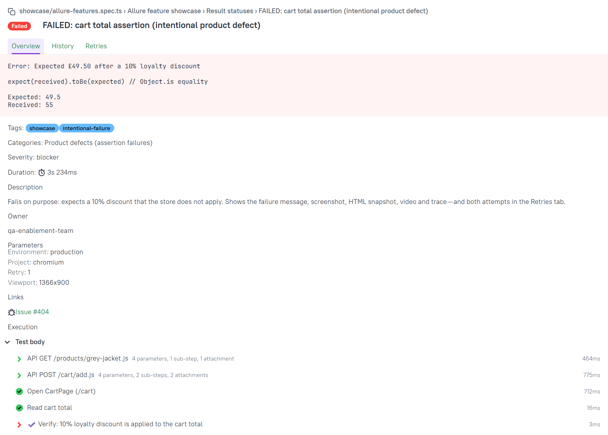

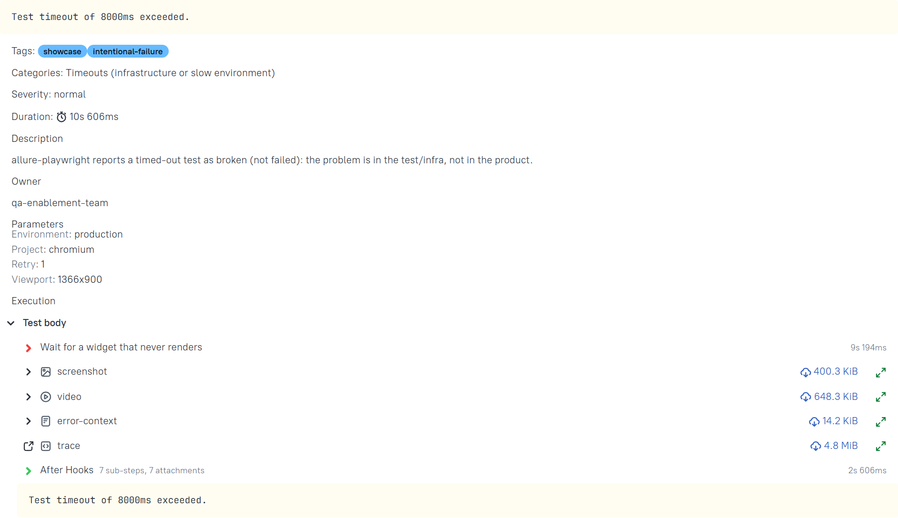

## 5.3 Behaviors: epic, feature, story

The **Behaviors** tab groups results by business capability instead of by file. Three labels drive it:

```ts
test.beforeEach(async () => {
  await AllureHelper.applyMetadata({ epic: 'Web Shop', feature: 'Checkout', owner: 'qa-checkout-team', layer: 'e2e' });
});

test('Pay now with an empty form lists every required field', async ({ cartPage, checkoutPage }) => {
  await AllureHelper.applyMetadata({ story: 'Checkout validation', severity: Severity.CRITICAL });
  // ...
});
```

Runtime calls made in `beforeEach` are applied to the test, which lets a whole `describe` share its epic, feature and owner.

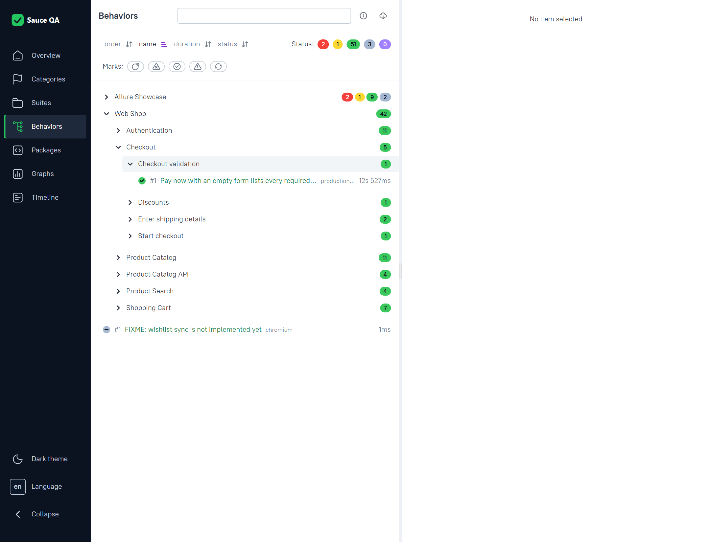

The **Features by stories** widget on the Overview page lists epics with the number of **features** under each (for example *Web Shop: 6* = Authentication, Product Catalog, Product Search, Product Catalog API, Shopping Cart, Checkout).

> **Note.** Tests skipped with `test.fixme()` never run their hooks, so runtime labels are not applied and they appear at the root of the Behaviors tree. Use static annotations (§5.14) if skipped tests must be grouped too.

## 5.4 Severity

Five levels are available through the `Severity` enum and appear in the result header, filters and the **Severity** graph:

| Level | Use for | Example in the project |
|---|---|---|
| `blocker` | Core business flow is impossible | Catalog lists every product; add to cart; reach checkout |
| `critical` | Major function broken, no workaround | Checkout validation, product prices |
| `normal` | Default | Search results, cart/API sync |
| `minor` | Cosmetic or edge case | Password recovery form, 404 page |
| `trivial` | Barely noticeable | Header navigation |

```ts
await allure.severity(Severity.BLOCKER);
```

## 5.5 Tags, owner, layer, custom labels and suites

```ts
test('Adding a product...', { tag: ['@smoke'] }, async () => { ... });  // Playwright tags → Allure tags
await allure.tags('metadata', 'documentation');                       // runtime tags
await allure.owner('qa-checkout-team');
await allure.layer('e2e');                    // e2e | api | ui | ...
await allure.label('component', 'storefront'); // any custom label
await allure.parentSuite('Allure Showcase');   // override the Suites tree
await allure.suite('Metadata');
await allure.subSuite('Labels & links');
```

Playwright tags work for both tools: `npx playwright test --grep @smoke` selects tests and Allure shows the tags as chips you can filter on.

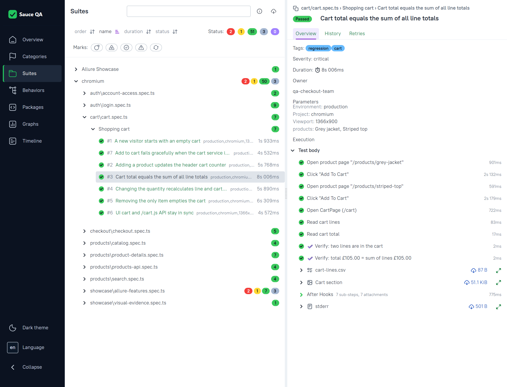

")

## 5.6 Detailed test steps

Steps make a report readable by people who never saw the code. This project uses four techniques.

**1. `allure.step()` with nesting and step parameters.** Each step has its own duration:

```ts
await allure.step('Level 1: browse the catalog', async (s1) => {
  await s1.parameter('page', '/collections/all');
  await catalogPage.open();

  await allure.step('Level 2: inspect products', async (s2) => {
    const products = await catalogPage.getProducts();
    await s2.parameter('products found', String(products.length));

    await allure.step('Level 3: pick the cheapest in-stock item', async (s3) => {
      const cheapest = [...products].sort((a, b) => a.price - b.price)[0];
      await s3.displayName(`Level 3: cheapest item is "${cheapest.name}" (${cheapest.priceText})`);
    });
  });
});
```

**2. The `@step` decorator** turns page-object methods into steps. `{0}` and `{1}` are replaced by the arguments, `{this.path}` by an instance property and `{class}` by the class name:

```ts
// src/utils/allure-helper.ts
export function step(title?: string) {
  return function <This, Args extends unknown[], Return>(
    target: (this: This, ...args: Args) => Promise<Return>,
    context: ClassMethodDecoratorContext<This, (this: This, ...args: Args) => Promise<Return>>,
  ) {
    return async function (this: This, ...args: Args): Promise<Return> {
      const className = (this as { constructor: { name: string } }).constructor.name;
      const name = title
        ? title
            .replace(/\{(\d+)\}/g, (_, i: string) => formatArg(args[Number(i)]))
            .replace(/\{this\.(\w+)\}/g, (_, prop: string) => formatArg((this as Record<string, unknown>)[prop]))
            .replace(/\{class\}/g, className)
        : `${className}.${String(context.name)}`;
      return allure.step(name, () => target.call(this, ...args));
    };
  };
}

// usage in a page object
@step('Open {class} ({this.path})')
async open(): Promise<void> { ... }
```

Playwright compiles TypeScript with support for standard (TC39) decorators, so no `experimentalDecorators` flag is needed.

**3. Assertion steps with explanatory messages.** `AllureHelper.verify()` wraps an assertion in a step named after *what* is validated, and `expect(value, message)` puts a business-level message into the error:

```ts
await AllureHelper.verify(`total £${total.toFixed(2)} = sum of lines £${expected.toFixed(2)}`, () => {
  expect(total).toBeCloseTo(lines.reduce((s, l) => s + l.lineTotal, 0), 2);
});
await AllureHelper.verify('10% loyalty discount is applied to the cart total', () =>
  expect(total, 'Expected £49.50 after a 10% loyalty discount').toBe(49.5),
);
```

**4. Log steps** mark decisions or observations without a body, with any status:

```ts
await allure.logStep('Decision: guest checkout path chosen', Status.PASSED);
await allure.logStep('Optional recommendation widget not present — skipped', Status.SKIPPED);
await allure.logStep('Non-critical analytics beacon failed', Status.BROKEN, new Error('beacon blocked'));
```

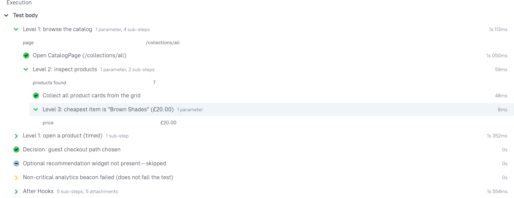

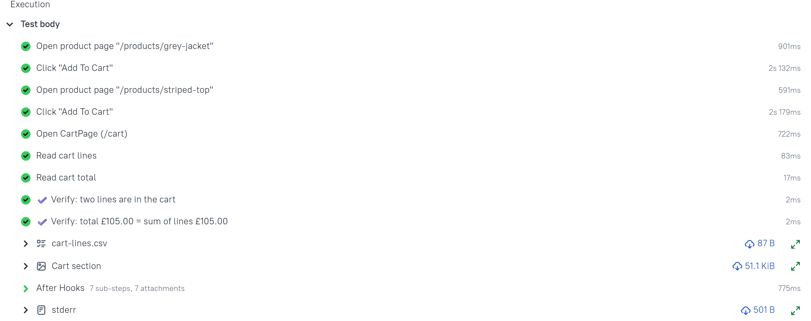

> **`detail: true` vs `false`.** With `detail: true` allure-playwright also records every `page.click()`, `expect()` and fixture as a step. Keep it off for stakeholder reports and switch it on while debugging: `ALLURE_DETAIL=true npm test`.

## 5.7 Visual evidence: screenshots, video, traces, HTML snapshots

| Evidence | How it is produced | Configured in |
|---|---|---|
| Screenshot on failure | Playwright `screenshot: { mode: 'only-on-failure', fullPage: true }` | `playwright.config.ts` |
| Checkpoint screenshots | `AllureHelper.checkpoint(page, 'name')` | tests |
| Element screenshot | `AllureHelper.attachElementScreenshot(locator, 'name')` | tests |
| Video | Playwright `video: 'retain-on-failure'` (or `'on'`) | config / `test.use()` |
| Trace | Playwright `trace: 'retain-on-failure'` | config / `test.use()` |
| HTML snapshot | `page.content()` attached as `text/html` on failure | evidence fixture |

```ts
async checkpoint(page: Page, name: string, options: { force?: boolean; fullPage?: boolean } = {}) {
  if (!config.checkpointScreenshots && !options.force) return;
  await allure.step(`📸 Checkpoint: ${name}`, async () => {
    const png = await page.screenshot({ fullPage: options.fullPage ?? false, animations: 'disabled' });
    await allure.attachment(`Checkpoint – ${name}`, png, ContentType.PNG);
  });
},
```

To always record video for one scenario, set it at **file level**. Playwright refuses `test.use({ video })` inside a `describe` because it needs a new browser context:

```ts
// src/tests/showcase/visual-evidence.spec.ts
test.use({ video: { mode: 'on', size: { width: 1366, height: 900 } }, trace: 'on' });
```

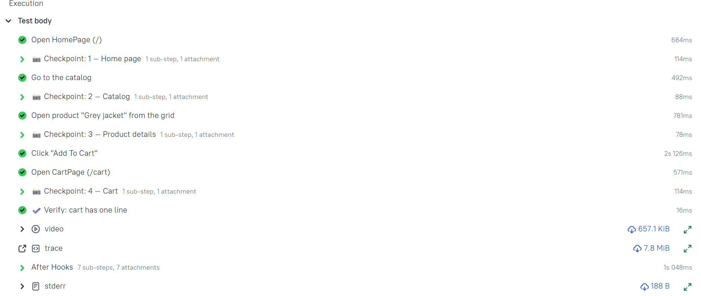

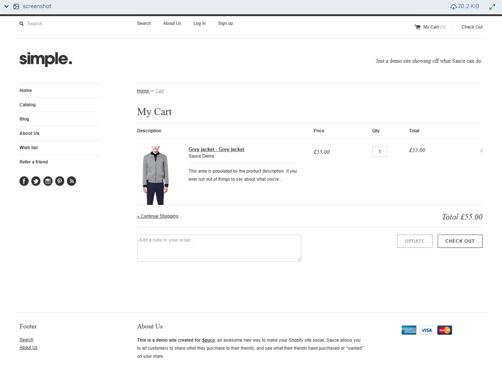

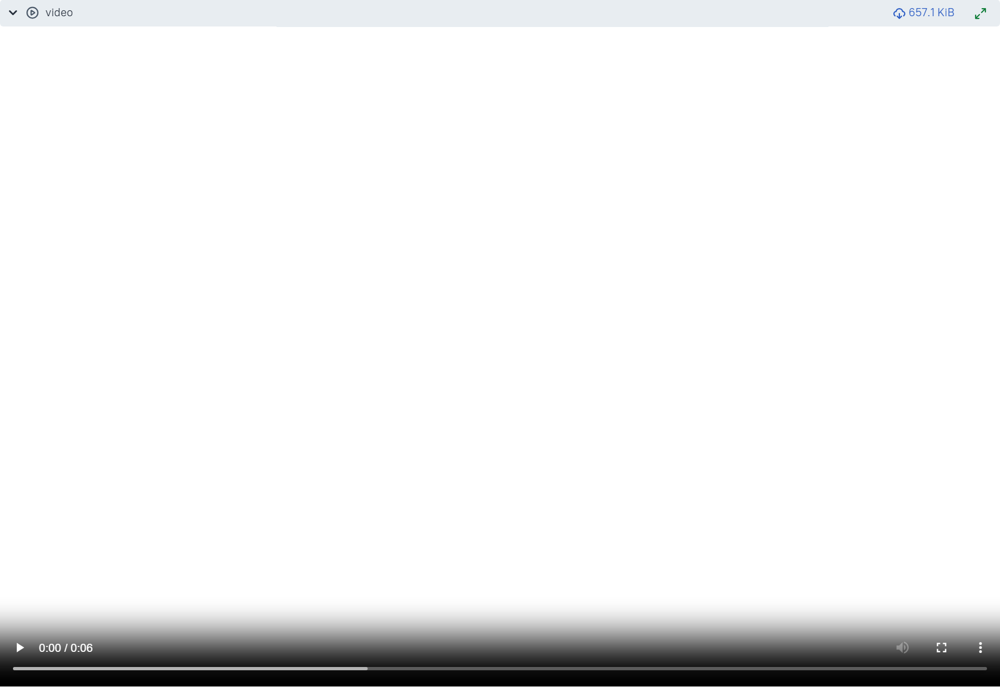

The **trace** attachment (`trace.zip`) can be downloaded from the report and opened with `npx playwright show-trace trace.zip` or at https://trace.playwright.dev. It is the most powerful debugging artefact: DOM snapshots before and after every action, network, console and source.

## 5.8 Network and performance monitoring

`src/utils/api-interceptor.ts` listens to Playwright's page events and records every exchange:

```ts
start(): void {
  this.page.on('request', this.onRequest);          // method, url, type, first-party?
  this.page.on('response', this.onResponse);        // status, headers, JSON body (first-party XHR/fetch)
  this.page.on('requestfinished', this.onFinished); // duration from request.timing()
  this.page.on('requestfailed', this.onFailed);     // transport errors (net::ERR_*)
}
```

At the end of each test the evidence fixture attaches:

- **🌐 Network summary** (JSON): totals, average and p95 time, slowest URL, counts by type and status;
- **🌐 Network log** (HTML table): first-party requests and all failures, with 4xx/5xx/failed rows in red and slow rows in yellow;
- **🔌 API calls with payloads**: request/response bodies of the store's AJAX API (sensitive headers are redacted);
- **❌ Failed network requests**, only when there are any;
- `network-log.csv` for failed tests.

It can also **simulate failures** with `page.route()`, which is great for error-handling tests:

```ts
test('Add to cart fails gracefully when the cart service is unreachable', async ({ productPage, network, shopApi }) => {
  await network.simulateNetworkFailure('**/cart/add.js');   // route.abort()
  await productPage.openByHandle('grey-jacket');
  await productPage.clickAddToCart();

  await expect.poll(() => network.find('/cart/add.js').filter((e) => e.outcome === 'failed').length).toBeGreaterThan(0);
  const { body } = await shopApi.getCart();
  await AllureHelper.verify('server-side cart is still empty', () => expect(body.item_count).toBe(0));
});
```

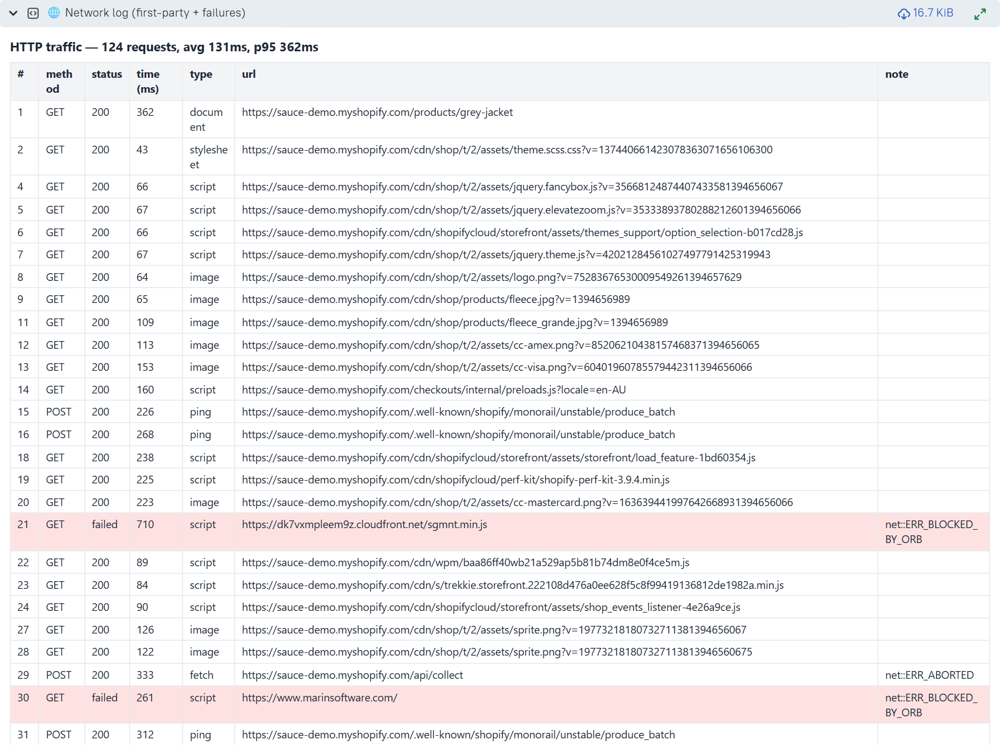

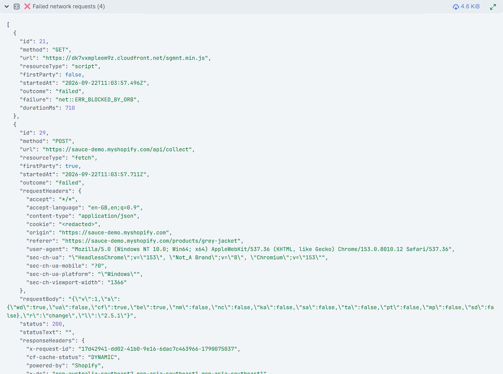

**Page performance.** The showcase measures Navigation Timing (TTFB, DOMContentLoaded, load, transfer size) for key pages and attaches it as CSV, with each measurement a step with parameters:

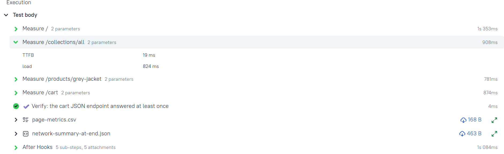

## 5.9 API testing with Allure steps

`ShopApiClient` wraps Playwright's `APIRequestContext`. Every call is a step with the method, URL, status and duration as parameters and the request/response bodies attached:

```ts
private async call<T>(method: 'GET' | 'POST', url: string, data?: unknown) {
  return allure.step(`API ${method} ${url}`, async (ctx) => {
    await ctx.parameter('method', method);
    await ctx.parameter('url', url);
    if (data !== undefined) await AllureHelper.attachJson(`Request ${method} ${url}`, data);

    const started = performance.now();
    const response = await this.raw(method, url, data);
    const durationMs = Math.round(performance.now() - started);
    await ctx.parameter('status', String(response.status()));
    await ctx.parameter('duration', `${durationMs} ms`);
    // ...parse, attach the response, throw on non-2xx
  });
}
```

Created from `page.request`, the client **shares cookies with the browser**, so the UI tests use it for fast setup: the checkout tests fill the cart through the API in `beforeEach` and only exercise the checkout in the UI.

 and the JSON response")

## 5.10 Console capture and logging

`ConsoleMonitor` records `console.*` messages and uncaught exceptions (`pageerror`). The evidence fixture attaches the full console output and a highlighted table of errors and warnings. Against the live store it regularly catches real problems, such as third-party 403s and a `TypeError` thrown by a theme script.

```ts
test('Browser console capture and analysis', async ({ page, consoleMonitor }) => {
  await page.goto('/');
  await page.evaluate(() => console.error('[demo] recommendation widget failed to load'));
  await AllureHelper.verify('the demo error was captured', () =>
    expect(consoleMonitor.errors().map((e) => e.text)).toContain('[demo] recommendation widget failed to load'),
  );
  await AllureHelper.verify('no uncaught JavaScript exceptions on first-party pages', () =>
    expect(consoleMonitor.getPageErrors().filter((e) => e.pageUrl.startsWith(config.baseURL))).toHaveLength(0),
  );
});
```

The per-test **Logger** buffers structured entries (levels, context and data) and attaches them as `📝 execution.log`. `logger.data('cart.total', 105)` records variable values for debugging. Only warnings and errors are echoed to the terminal by default (`LOG_LEVEL`), and allure-playwright also attaches the test's stdout/stderr.

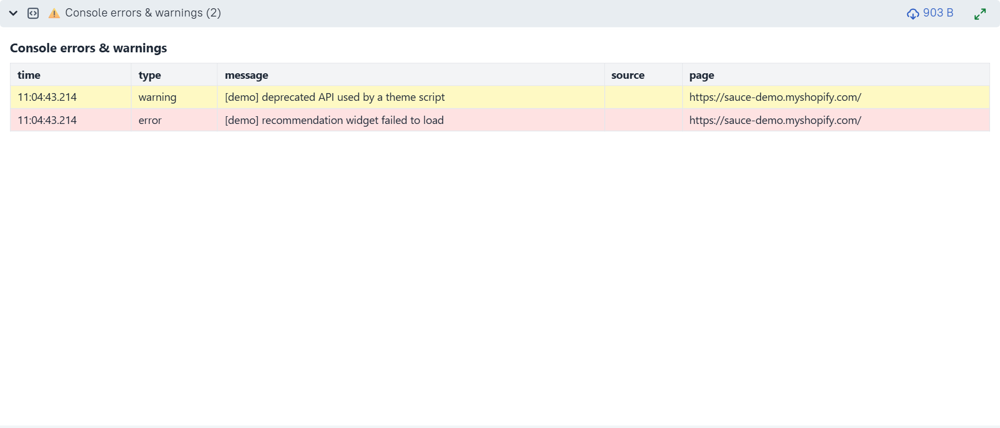

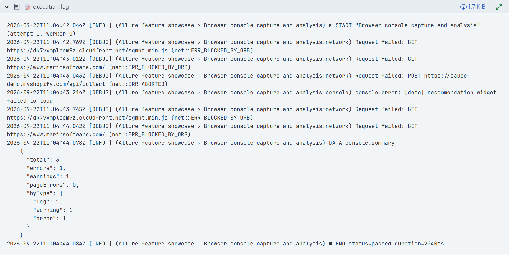

## 5.11 Parameters and test data

Parameters describe *what data* a result ran with. Allure uses them to tell data-driven variants apart:

```ts
await allure.parameter('Customer tier', 'Gold');                                  // plain
await allure.parameter('API key', 'sk_live_51H8secret', { mode: 'masked' });       // shown as ******
await allure.parameter('Internal trace id', 'trace-7f3a9', { mode: 'hidden' });    // not shown at all
await allure.parameter('Run timestamp', new Date().toISOString(), { excluded: true }); // not part of history id
```

> **`excluded` does not hide a parameter.** It only removes it from the *history id*, so values that change on every run (timestamps, retry numbers, viewports) do not split a test's history. Use `mode: 'hidden'` to hide it.

**Data-driven tests** generate one Allure result per data row. The source file is attached as evidence:

```ts
const customers = loadCsv<Customer>('checkout-customers.csv');

for (const customer of customers) {
  test(`Shipping details are accepted for ${customer.label}`, async ({ cartPage, checkoutPage }) => {
    await allure.parameter('customer', customer.label);
    await allure.parameter('email', customer.email, { mode: 'masked' });
    await AllureHelper.attachCsv('checkout-customers.csv (data source)', readDataFile('checkout-customers.csv'));
    // ...
  });
}
```

")

## 5.12 Environment and executor information

The **Environment** widget reads `allure-results/environment.properties`, and the **Executors** widget reads `executor.json`. The project writes both in global teardown (`src/config/allure-metadata.ts`) so they can include **runtime** data such as the exact browser version, which each worker records:

```ts
browserMetadata: [
  async ({ browser, browserName }, use, workerInfo) => {
    fs.mkdirSync(META_DIR, { recursive: true });
    fs.writeFileSync(path.join(META_DIR, `browser-${workerInfo.project.name}.json`),
      JSON.stringify({ project: workerInfo.project.name, browserName, browserVersion: browser.version() }));
    await use();
  },
  { auto: true, scope: 'worker' },
],
```

The resulting `environment.properties` looks like this:

```properties
Environment=production
Base\ URL=https\://sauce-demo.myshopify.com
OS=Windows_NT 10.0.26200 (x64)
Node.js=v22.18.0
Headless=true
Viewport=1366x900
Retries=1
Browser\ (chromium)=chromium 153.0.8010.12
```

`executor.json` detects GitHub Actions and Jenkins (build name, number and URL) and falls back to a local executor with an incrementing build number. The build number labels the x-axis of the trend charts.

Per test, the evidence fixture adds *excluded* parameters (viewport, environment), and allure-playwright adds the Playwright **Project** (browser) as a parameter, so cross-browser results of the same test are distinguishable.

## 5.13 Retries and flaky tests

Playwright retries are configured with `retries` (1 locally, 2 on CI in this project). Allure groups all attempts of a test into **one** result; earlier attempts appear in the **Retries** tab. A test that failed and then passed is marked **flaky**.

```ts
test('FLAKY: fails on the first attempt, passes on retry', async ({ page }, testInfo) => {
  await allure.parameter('attempt', String(testInfo.retry + 1), { excluded: true });
  await page.goto('/');
  await AllureHelper.verify(`simulated race condition resolved (attempt ${testInfo.retry + 1})`, () =>
    expect(testInfo.retry, 'first attempt loses the simulated race').toBeGreaterThan(0),
  );
});
```

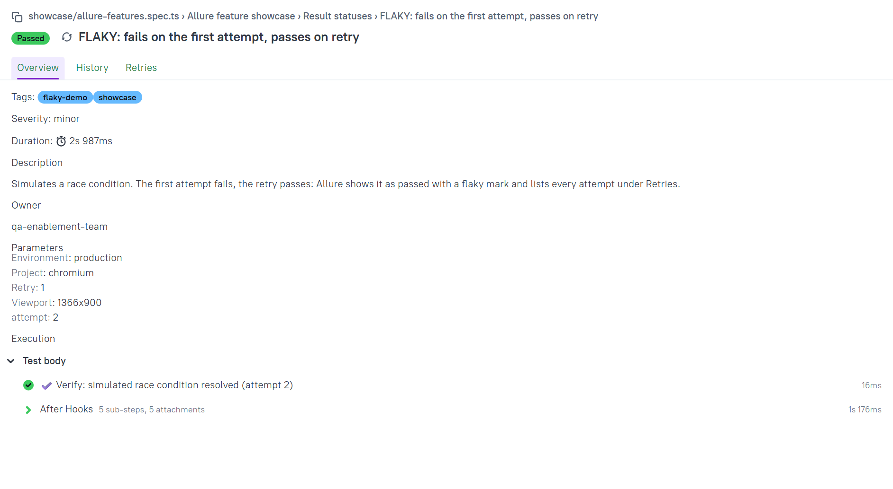

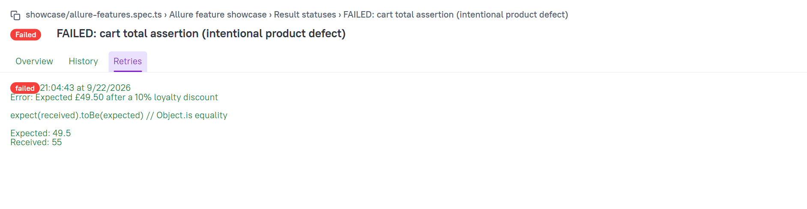

allure-playwright adds a `Retry` parameter (excluded from history) to retried attempts. Use the **Marks** filter (flaky, new failed, new broken, retries) in the tree views to find them quickly.

## 5.14 Links and relationships

Links connect a result to the rest of your tooling. Templates in `allure-report.config.ts` turn short ids into URLs:

```ts
links: {
  issue: { urlTemplate: 'https://github.com/your-org/playwright-allure-showcase/issues/%s', nameTemplate: 'Issue #%s' },
  tms:   { urlTemplate: 'https://your-org.testrail.io/index.php?/cases/view/%s', nameTemplate: 'TC-%s' },
  jira:  { urlTemplate: 'https://your-org.atlassian.net/browse/%s', nameTemplate: '%s' },
},
```

```ts
await allure.issue('101');                                   // → Issue #101
await allure.tms('5001');                                    // → TC-5001
await allure.link('SHOP-204', 'Jira: SHOP-204', 'jira');     // custom type with its own template
await allure.link('https://allurereport.org/docs/playwright/', 'Allure Playwright docs', 'docs');
await allure.link('https://allurereport.org/docs/playwright-reference/', 'Related: API reference', 'related');
```

Metadata can also be declared **statically** with Playwright annotations, which is useful for tests that are skipped before any code runs:

```ts
test('Rich metadata: labels, links, severity and descriptions', {
  tag: ['@smoke'],
  annotation: [
    { type: 'allure.label.feature', description: 'Report metadata' },
    { type: 'allure.label.story', description: 'Labels and links' },
    { type: 'issue', description: 'https://github.com/your-org/playwright-allure-showcase/issues/7' },
  ],
}, async ({ homePage }) => { ... });
```

**Relationships between tests** are expressed through shared labels and links. Tests with the same `story` form a group in Behaviors; the same `issue` or `tms` id links tests that cover the same requirement; `allureId`/`testCaseId` give results a stable identity for TMS integrations; and `related` links point to other tests or specifications.

## 5.15 History and trend analysis

Allure keeps a `history/` folder inside each generated report. When the **next** report is generated, the previous `history/` must be copied into `allure-results/` first. That single step enables:

- the **Trend**, **Duration trend**, **Retries trend** and **Categories trend** graphs;
- the **History** tab of every test (its last runs with status and duration);
- the **new failed / new broken / flaky** marks.

`scripts/generate-report.ts` automates it:

```ts
const restored = copyDir(path.join(historyDir, 'history'), path.join(resultsDir, 'history'));  // before
await runAllure(['generate', resultsDir, '-o', reportDir, '--clean', '--name', allureConfig.reportName]);
copyDir(path.join(reportDir, 'history'), path.join(historyDir, 'history'));                    // after
```

Allure always adds the *current* results as a new point on top of the restored history. To re-render the same results (for example as a single file) without counting them twice, run `npx tsx scripts/generate-report.ts --single-file --no-history-save`: the script then restores the history that was the *input* of the last build (`allure-history/previous-history/`) and does not save a new one.

On CI the history lives on the `gh-pages` branch (GitHub Actions) or is managed by the Allure Jenkins plugin (§9).

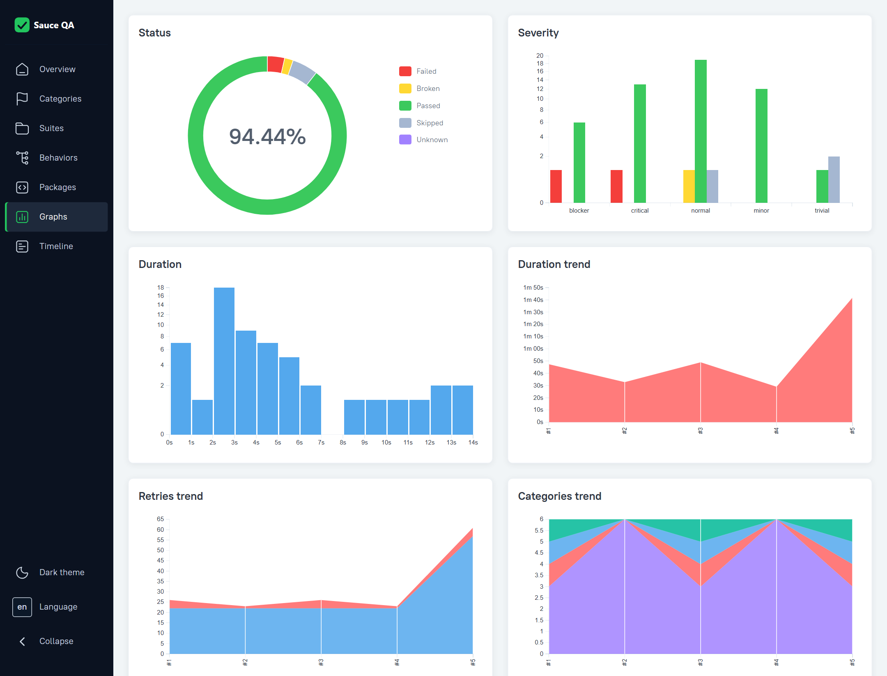

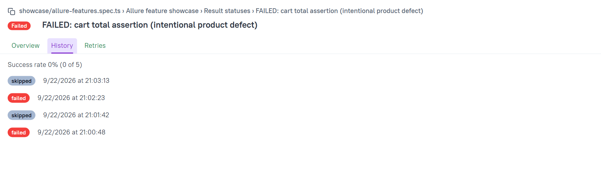

## 5.16 Custom attachments

Any content can be attached; the content type decides how Allure renders it:

| Content type | Rendering | Helper |
|---|---|---|
| `application/json` | pretty-printed, collapsible | `AllureHelper.attachJson()` |
| `text/csv` | table | `AllureHelper.attachCsv()` |
| `text/plain` | monospace text | `AllureHelper.attachText()` |
| `text/html` | rendered HTML (sandboxed iframe) | `AllureHelper.attachHtml()` |
| `image/png`, `image/svg+xml` | image | `allure.attachment(name, buf, ContentType.PNG)` |
| `video/webm` | video player | automatic (Playwright video) |
| `application/xml`, `text/uri-list` | text / clickable links | `allure.attachment(..., ContentType.XML / URI)` |
| any file on disk | download or preview | `allure.attachmentPath(name, path, { contentType })` |

```ts
await AllureHelper.attachJson('order-payload.json', { orderId: 'SO-10042', items: [...], currency: 'GBP' });
await AllureHelper.attachCsv('price-matrix.csv', [{ product: 'Grey jacket', price: 55, vat: 9.17 }, ...]);
await allure.attachment('sitemap-extract.xml', '<urlset>...</urlset>', ContentType.XML);
const logFile = testInfo.outputPath('application.log');
fs.writeFileSync(logFile, '[INFO] cart service ready\n[WARN] slow response 1800ms');
await AllureHelper.attachFile('application.log (file)', logFile, ContentType.TEXT);
await testInfo.attach('playwright-native-attachment.txt', { body: '...', contentType: 'text/plain' }); // also lands in Allure
```

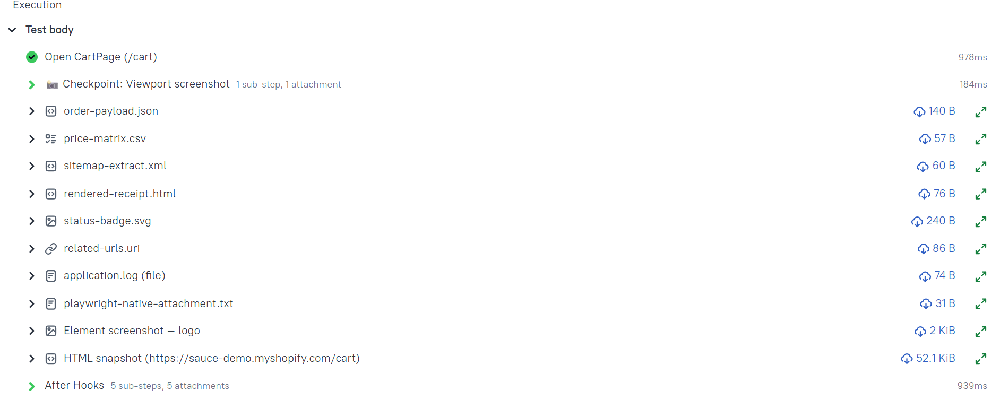

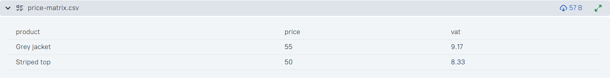

## 5.17 Categories: automatic defect triage

Categories sort failures by **message or stack-trace regex** and status. The first matching rule wins:

```ts
categories: [
  { name: 'Known issues (captcha / bot protection)', messageRegex: '.*(captcha|hCaptcha|bot protection).*',
    matchedStatuses: [Status.FAILED, Status.BROKEN] },
  { name: 'Timeouts (infrastructure or slow environment)', messageRegex: '.*(Timeout|timed out|exceeded).*',
    matchedStatuses: [Status.BROKEN, Status.FAILED] },
  { name: 'Network / API failures', messageRegex: '.*(net::ERR|ECONNREFUSED|status code|HTTP [45]\\d\\d|API).*',
    matchedStatuses: [Status.FAILED, Status.BROKEN] },
  { name: 'Product defects (assertion failures)', messageRegex: '.*(expect|Expected|toBe|toHave|toEqual|toContain).*',
    matchedStatuses: [Status.FAILED] },
  { name: 'Test defects (broken tests)', matchedStatuses: [Status.BROKEN] },
  { name: 'Flaky tests', matchedStatuses: [Status.PASSED, Status.FAILED, Status.BROKEN], flaky: true },
  { name: 'Ignored / skipped tests', matchedStatuses: [Status.SKIPPED] },
],
```

The *KNOWN ISSUE* showcase test fails with the message "hCaptcha bot protection prevents automated sign-in", so it lands in its own category instead of mixing with real product defects.

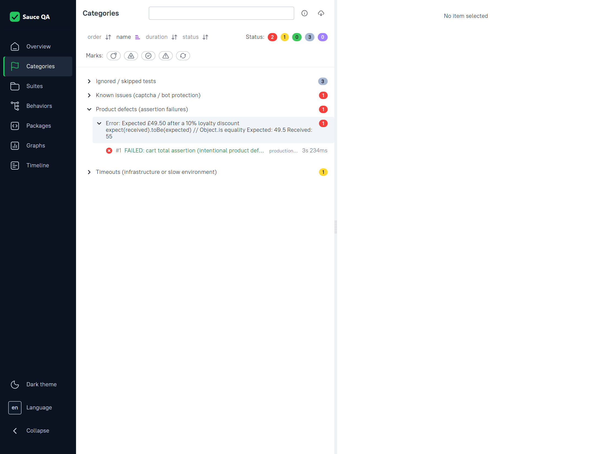

## 5.18 Timeline and Packages

The **Timeline** shows when each test ran on which worker, which is useful for spotting slow tests, idle workers and parallelisation problems. **Packages** groups results by file path.

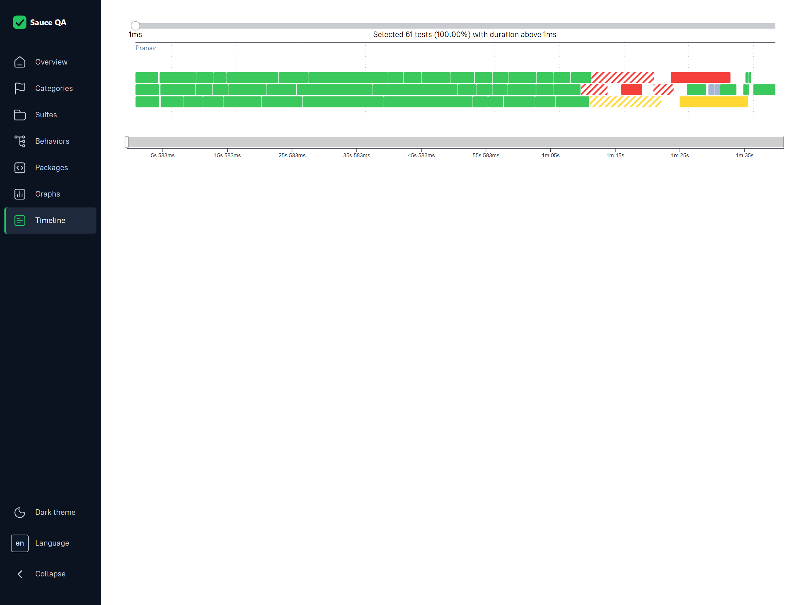

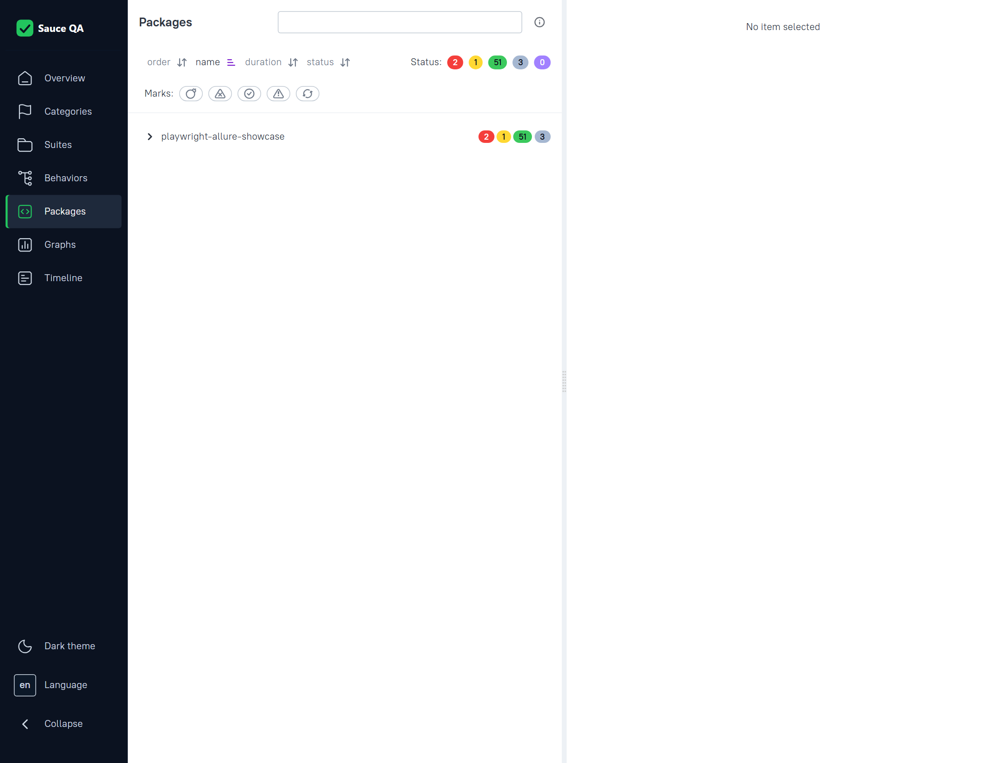

# 6. Best Practices

## 6.1 Write reports for humans

- **Name tests after behaviour**, not implementation: "Cart total equals the sum of all line totals", not "test_cart_03".
- **Use steps as the test case.** A reader should understand the scenario from the step list alone. Decorate page-object methods and name verification steps after the business rule.
- **Put the "why" in assertion messages**: `expect(total, 'Expected £49.50 after a 10% loyalty discount')`.
- **Keep `detail: false` by default**; turn it on while debugging.

## 6.2 Metadata discipline

- Agree on a small, fixed set of **epics and features** that mirror the product. Put them in `beforeEach` so a `describe` shares them.
- Give every test a **severity** and an **owner** so failures are routed quickly.
- Link tests to **issues/TMS ids** with templates instead of hard-coded URLs.
- Use **tags** for run selection (`@smoke`, `@regression`) and keep them in the title's `tag` option.

## 6.3 Evidence without noise

- Attach evidence **automatically in fixtures**, not by hand in each test.
- Prefer `retain-on-failure` for video and trace: full evidence for failures, small reports for green runs.
- Capture **checkpoint screenshots** at meaningful moments only, and disable them in large suites (`CHECKPOINT_SCREENSHOTS=false`).
- **Redact secrets**: mask parameters (`mode: 'masked'`) and strip `cookie`/`authorization` headers from network logs (done in `api-interceptor.ts`).
- Truncate large bodies; the report is a static site that people download.

## 6.4 Stable history

- Keep **test titles stable**: the history id is derived from the test's full name and its non-excluded parameters.
- Mark volatile parameters as `excluded: true`.
- Always restore `history/` before generating on CI, or the trends reset.
- Clean `allure-results/` before each run (except when merging shards).

## 6.5 Flakiness

- Use retries to **surface** flakiness, not to hide it. Review the *Flaky* marks and the *Retries trend* regularly.
- Wait for the real signal (the `/cart/add.js` response, a URL change, a visible element) instead of fixed timeouts. See `ProductPage.addToCart()`.

## 6.6 Speed

- Set up state through the **API** (`shopApi.addToCart`) and test only the behaviour under test through the UI.
- Run fully parallel with isolated browser contexts; the Timeline shows whether workers are well used.

# 7. Troubleshooting

| Symptom | Cause | Solution |
|---|---|---|
| `ERROR: JAVA_HOME is set to an invalid directory` | `JAVA_HOME` points to a missing folder or to `.../bin` | Point it at the JDK root. The project's scripts repair it for their own process (`scripts/lib/allure-cli.ts`): they fall back to the parent folder or to `java` on the PATH |
| `allure: command not found` / `'allure' is not recognized` | CLI not installed globally | Use `npx allure …` or the npm scripts; `allure-commandline` is a dev dependency |
| Report shows **no tests** or old tests | Results never written, or results from several runs mixed | Check `allure-results/` contains `*-result.json`; clean it before each run (global setup does) |
| **No results after passing `--reporter=…` on the CLI** | A CLI `--reporter` *replaces* all reporters from the config | Do not pass `--reporter`, or pass both: `--reporter=list,allure-playwright` |
| Blank page when opening `index.html` | `file://` blocks the report's XHR requests | `npm run allure:open`, `allure serve`, or `--single-file` |
| **Trend graphs empty** | `history/` was not copied into `allure-results/` before generating | Use `npm run allure:generate`; on CI restore the history (see §9) |
| Every test counts as "new" in history | Titles or non-excluded parameters change between runs | Keep titles stable; mark volatile parameters `excluded: true` |
| Expected "broken", got "failed" | allure-playwright 3 reports all failures as failed; only timeouts are broken | See §5.2; use Categories to separate infrastructure errors by message |
| `Cannot use({ video }) in a describe group` | Browser/context options need a new worker | Put `test.use({ video, trace })` at the top of the file |
| Labels set in `beforeEach` missing on skipped tests | `test.fixme()` / declarative skip never runs hooks | Use static annotations (`allure.label.*`) |
| Excluded parameter still visible | `excluded` only affects the history id | Use `mode: 'hidden'` |
| Login tests can't sign in | Store is protected by hCaptcha | Expected: assert "not authenticated" (§1.1). For real apps use a test-mode captcha key or an API login |
| Attachment too big / slow report | Full-page screenshots or long bodies on every step | Use viewport screenshots, truncate bodies, `retain-on-failure` video |
| `Executable doesn't exist … ms-playwright` | Browsers not installed for this Playwright version | `npx playwright install chromium` (add `--with-deps` on Linux CI) |
| Test data variables look wrong in failures | Hard to see runtime values | Use `logger.data('name', value)` and read `📝 execution.log` |

# 8. Advanced Customization

## 8.1 One configuration file

`allure-report.config.ts` holds the results/report/history folders, report name and language, link templates, categories, static environment entries and theme settings. `playwright.config.ts`, the metadata writer and the report scripts all import it, so there is a single place to change.

## 8.2 Custom theme and logo

Allure 2 has no theming API, but the report is a static web app. `generate-report.ts` injects `allure-theme/custom-theme.css` into `index.html` as an inline `<style>` (so it also works for `--single-file` reports), with `url(logo.svg)` replaced by an inline data URI of `allure-theme/logo.svg`:

```css
:root { --brand: #22c55e; --nav-bg: #0b1220; --nav-hover: #1e293b; --nav-text: #cbd5e1; }

.side-nav { background: var(--nav-bg) !important; }
.side-nav__brand { background: url(logo.svg) no-repeat 14px center !important; background-size: 130px 35px !important; }
.side-nav__brand-icon, .side-nav__brand-text { visibility: hidden; }
.side-nav__icon { color: var(--nav-text) !important; }            /* icons are stroke="currentColor" */
.side-nav__link_active { box-shadow: inset 3px 0 0 var(--brand); color: #fff !important; }
.app__content a:not(.button) { color: #15803d; }
```

Edit the CSS and re-apply it without regenerating: `npx tsx scripts/docs/inject-theme.ts`. Recent Allure 2 releases (2.46 is used here) also have a built-in **dark theme** (sidebar toggle):

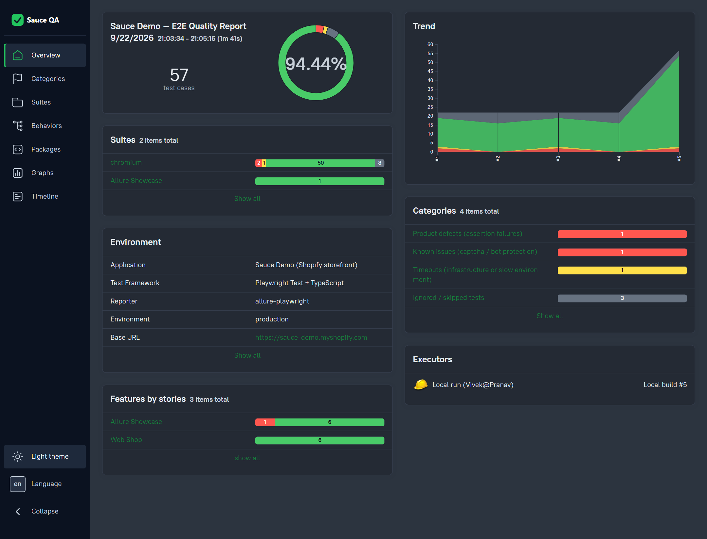

Allure ships a `custom-logo-plugin` that you can enable in `allure.yml` and pass with `allure generate --config`, but CSS injection is simpler and survives `--single-file`.

## 8.3 Report name, language and filters

```bash
allure generate allure-results -o allure-report --clean --name "Sauce Demo – E2E Quality Report" --lang en
```

In the tree views you can filter by **status**, by **marks** (flaky, new failed, new broken, retries) and by test name. Sort by order, name, duration or status. The download icon exports the tree as CSV.

## 8.4 Global labels and listeners

```ts
globalLabels: { application: 'sauce-demo-storefront' },   // added to every result
listeners: [{ beforeTestResultWrite: (result) => { /* mutate or enrich results */ } }],
```

## 8.5 Running a subset with a test plan

allure-playwright supports Allure TestOps test plans: set `ALLURE_TESTPLAN_PATH=testplan.json` to run only the listed tests (by `allureId` or full name).

## 8.6 Allure Report 3

Allure Report 3 (`npx allure` from the `allure` npm package) is a TypeScript rewrite that does not need Java. It reads the same `allure-results/`, so this framework works with it unchanged. Configure it with an `allurerc.mjs`:

```js
// allurerc.mjs (Allure 3)
import { defineConfig } from 'allure';

export default defineConfig({
  name: 'Sauce Demo – E2E Quality Report',
  output: './allure-report',
  historyPath: './allure-history/history.jsonl',   // built-in history, no copying needed
  plugins: { awesome: { options: { singleFile: false, reportLanguage: 'en' } } },
});
```

Allure 2 remains the default here because of its mature Categories, Graphs and Timeline pages and its Jenkins plugin.

# 9. CI/CD Integration

## 9.1 GitHub Actions

`.github/workflows/playwright-allure.yml` runs on push, pull requests, a weekday schedule and on demand:

1. install Node 22, Java 17, dependencies and browsers;
2. run the tests (`continue-on-error`, so the report is always produced);
3. check out `gh-pages` and copy its `history/` into `allure-history/`;
4. `npm run allure:generate` (the executor picks up the run number and URLs);
5. upload the report and raw results as artifacts;
6. publish `allure-report/` to GitHub Pages (main branch only);
7. fail the job if the tests failed.

```yaml
- name: Restore Allure history
  uses: actions/checkout@v4
  continue-on-error: true
  with: { ref: gh-pages, path: gh-pages }

- name: Generate Allure report (with trends)
  run: |
    mkdir -p allure-history
    if [ -d gh-pages/history ]; then cp -r gh-pages/history allure-history/history; fi
    npm run allure:generate

- name: Publish to GitHub Pages
  if: github.ref == 'refs/heads/main'
  uses: peaceiris/actions-gh-pages@v4
  with: { github_token: '${{ secrets.GITHUB_TOKEN }}', publish_branch: gh-pages, publish_dir: allure-report }
```

Enable GitHub Pages for the `gh-pages` branch once in the repository settings. The CI run sets `SHOWCASE_FAILURES=false` so the pipeline stays green.

## 9.2 Jenkins

Install the **Allure Jenkins plugin** and configure an *Allure Commandline* tool. The plugin generates the report, keeps history between builds, writes the executor and adds an "Allure Report" link and a trend chart to the job page:

```groovy
pipeline {
  agent { dockerfile { filename 'docker/Dockerfile'; args '--ipc=host' } }
  stages {
    stage('Install') { steps { sh 'npm ci' } }
    stage('Test')    { steps { sh 'npx playwright test || true' } }
  }
  post {
    always {
      allure([results: [[path: 'allure-results']], reportBuildPolicy: 'ALWAYS'])
    }
  }
}
```

## 9.3 Docker

`docker/Dockerfile` extends the official Playwright image with Java 17, so one image can run tests *and* generate reports:

```bash
docker compose run --rm tests     # run tests + generate ./allure-report (history in ./allure-history)
docker compose up report          # serve the report with nginx on http://localhost:8080
```

`--ipc=host` (set in `docker-compose.yml`) prevents Chromium from running out of shared memory.

## 9.4 Sharding and merging

With `npx playwright test --shard=1/4` on several machines, upload each machine's `allure-results/` as an artifact, download them all into one folder and generate a single report. Allure merges results by file, and every result file has a unique name. Set `ALLURE_KEEP_RESULTS=true` if shards share a workspace.

# 10. Command Reference

| Command | Purpose |
|---|---|
| `npm test` | Run all tests (headless, chromium) |
| `npm run test:headed` | Run with a visible browser |
| `npm run test:debug` | Playwright Inspector, one worker |
| `npm run test:smoke` / `test:regression` | Tag-based subsets |
| `npm run test:auth` / `test:products` / `test:cart` / `test:checkout` / `test:showcase` | Suites |
| `npm run test:all-browsers` | chromium, firefox, webkit, mobile |
| `npm run test:staging` | Use the staging profile |
| `npm run test:report` | Run tests, then always generate the report |
| `npm run allure:generate` | Generate with history, metadata and theme |
| `npm run allure:single-file` | One self-contained HTML report |
| `npm run allure:open` | Open the generated report |
| `npm run allure:serve` | Temporary report straight from results |
| `npm run trend:demo` | Build several reports to populate trends |
| `npm run clean` / `clean:all` | Remove results/reports (`clean:all` also drops history) |
| `npm run typecheck` | TypeScript type check |
| `npm run docs:screenshots` / `docs:pdf` | Rebuild this tutorial's images / PDF |
| `SHOWCASE_FAILURES=false npm test` | Skip the intentionally failing tests |
| `ALLURE_DETAIL=true npm test` | Verbose Playwright steps in Allure |
| `npx playwright show-trace <trace.zip>` | Open a trace downloaded from the report |

## Further reading

- Allure Report documentation: https://allurereport.org/docs/
- allure-playwright reference: https://allurereport.org/docs/playwright-reference/
- Playwright documentation: https://playwright.dev/docs/intro
